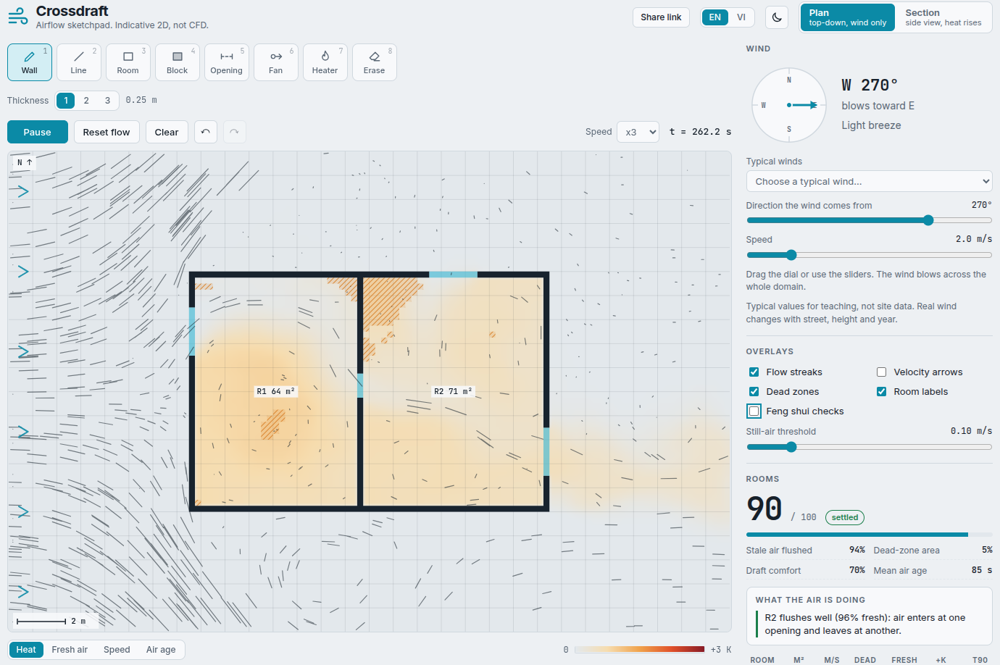

# Crossdraft

Draw a floor plan or a section, choose the wind, press Start, and watch air move through the rooms.
A static Next.js (App Router, TypeScript) site with no backend. Indicative 2D airflow, **not CFD**.



## Features
- Plan view (top-down) and Section view (side view with gravity and buoyancy)
- Tools: wall, line, room, block, opening, fan, heater, erase. Undo and redo.
- Wind dial and speed (m/s, with Beaufort label); wind comes from any direction
- Views: fresh air, speed, air age, temperature. Overlays: flow streaks, arrows, dead zones.
- Per-room metrics: area, mean speed, dead-zone %, fresh-air %, temperature rise, time to 90% fresh, plus a 0-100 score
- A/B tests: run a fixed-length test into slot A or B and compare layouts
- Example layouts, layout code export/import, hover probe
- Plain-language insights per room ("R2 stays stale: only one opening")
- Typical Vietnamese wind presets (monsoon and summer breeze), clearly labelled as not site data
- Opt-in feng shui check (Phong Thuy in Vietnamese): marks a front door lined up with a back door and shows the air along it (tradition vs. physics, no luck score)
- Share a design with a link (the layout is stored in the URL)
- English and Vietnamese UI (the Vietnamese text still needs a native-speaker review)
- Light and dark theme (sun/moon switch in the header, follows the OS by default)

## Run
```bash
npm install
npm run dev          # http://localhost:3000
```

## Develop
```bash
npm test             # vitest: solver physics + layout-code tests (the solver suite takes ~2 min)
npm run typecheck
npm run build        # static export to out/
```

## Project layout
- `lib/`: solver (`sim.ts`), layout codes and share links (`layout.ts`), canvas engine (`engine.ts`), drawing helpers, presets, insights, Phong Thuy checks, wind presets, translations (`i18n.ts`)
- `components/`: React UI (`App`, `Stage`, `Side`, `ThemeToggle`, `LangToggle`)
- `app/`: Next.js layout, page and global CSS
- `tests/`: vitest suites
- `legacy/`: the original single-file version, kept for reference

## Deploy (free)
`next.config.mjs` uses `output: 'export'`, so `npm run build` writes a static site to `out/`.
Serve that folder from GitHub Pages, Cloudflare Pages, Netlify or Vercel.

## How it works
The full explanation, with the equations and the limits, is in [docs/ALGORITHMS.md](docs/ALGORITHMS.md). In short:
- Incompressible "stable fluids" solver (Stam) on a padded grid: advect, project (SOR pressure solve), advect scalars.
- Scalars: fresh air (tracer), air age, temperature. Section view adds Boussinesq buoyancy.
- Walls are solid cells; openings are fluid cells that also split rooms for metrics.
- Score = 50 x flushed + 30 x (1 - dead zone) + 20 x comfort.

## Limitations (read before quoting a number)
- 2D only. A plan has no flow over the roof, so indoor speeds and deflection are overstated.
- Use it to compare layouts, not to certify them. For real accuracy use OpenFOAM or similar.
- Layouts are saved in your browser only (localStorage).

## License
See `LICENSE`.